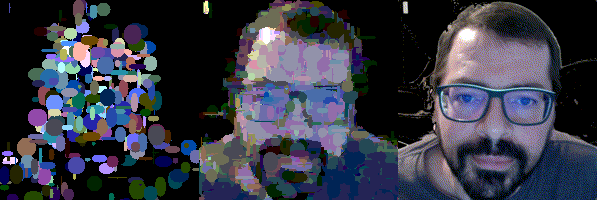

# Image Hill-Climb

This is a fun little project based on a 
[blog post](https://gkbrk.com/2018/01/evolving-line-art/) I ran across. 
I thought I'd use it to get familiar with jupyter and some python libraries.

Basically, you start with a blank image and add random shapes to it. When
the shape brings you closer to a given target image, you keep it. Otherwise,
you throw it away.  In this way, you "hill-climb" toward the target.

After working out how to pull together `PIL` and `numpy` in `jupyter`, I 
turned around and wrote the hillclimb.py script (run with `--help` to see the arguments).

Then, I made a second version using the python `multiprocessing` library to make multiple processes
that "race" to find the best shapes.  This only really helps when the 
image is already pretty good, and few guesses actually improve the image. Until
then, the single-threaded version performs almost as well with fewer resources.

The shape types supported are:

 - ellipse
 - filled\_ellipse
 - rectangle
 - filled\_rectangle
 - line
 - downleft\_line (_lines that only go from upper-left to lower-right_)
 - arc

The program takes arguments to control the number of iterations and the number of shapes tried
per iteration. It also accepts a starting image so you can continue where you left off on the last
run.  It will save off the final image, and also saves an image every 10th iteration so you can 
monitor the progress.
 
I install these two programs as modules `toys.y2018.hillclimb` and 
`toys.y2018.hillclimb_multi`.

## Java Version

For comparison, I made a multithreaded java version, included here in the
repository.  It only does filled ellipses, while the python version can do
 a variety of shapes.

